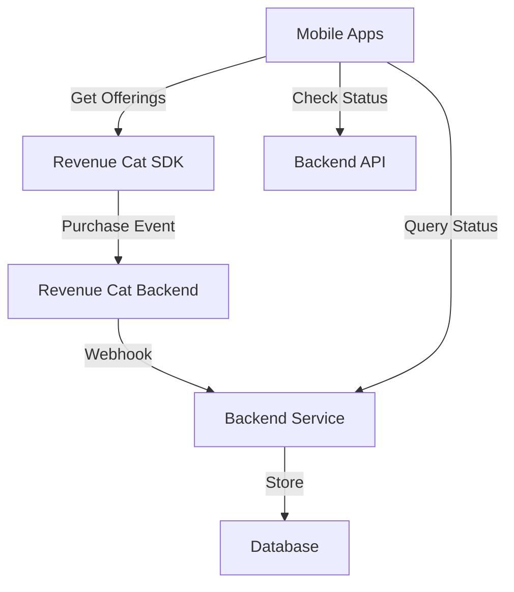
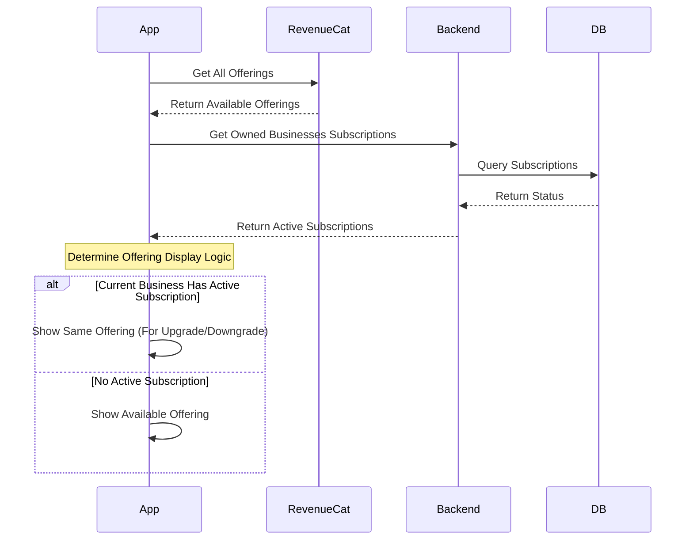
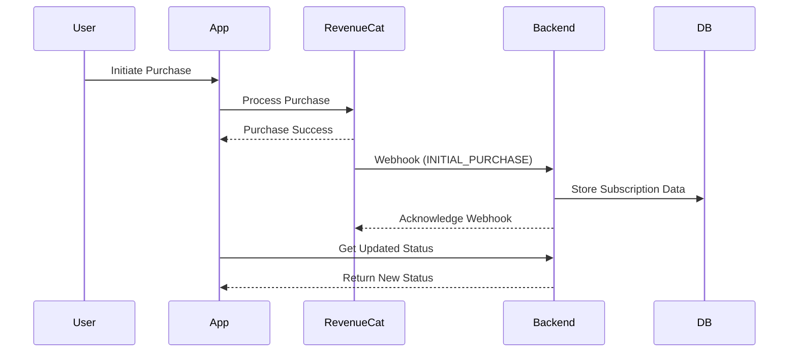
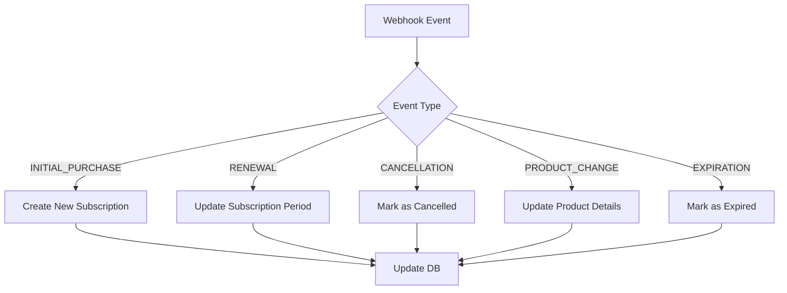
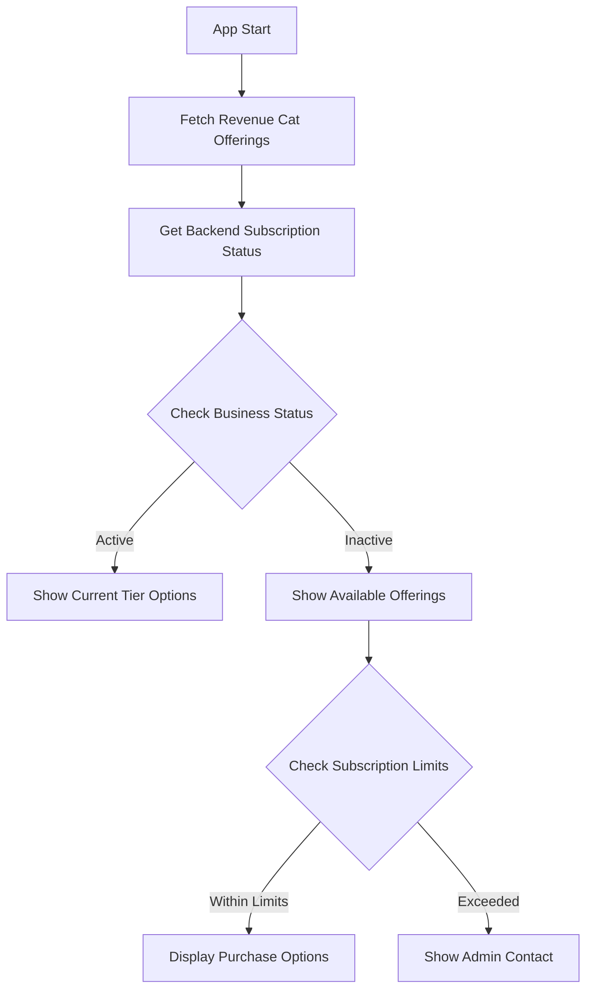
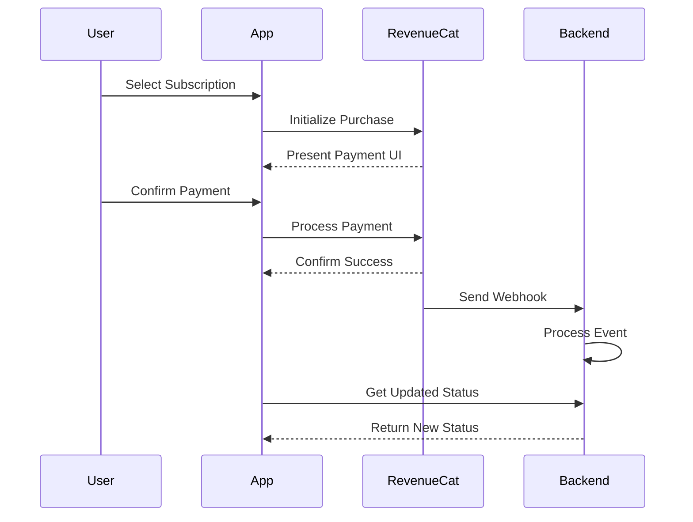
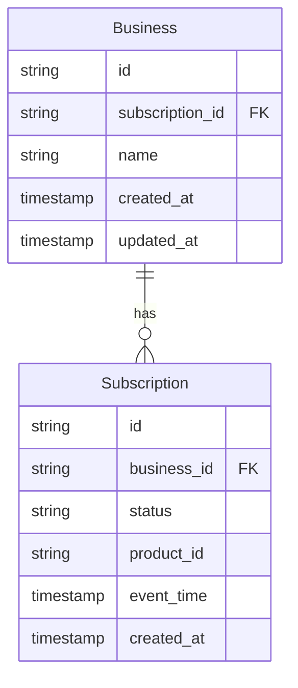
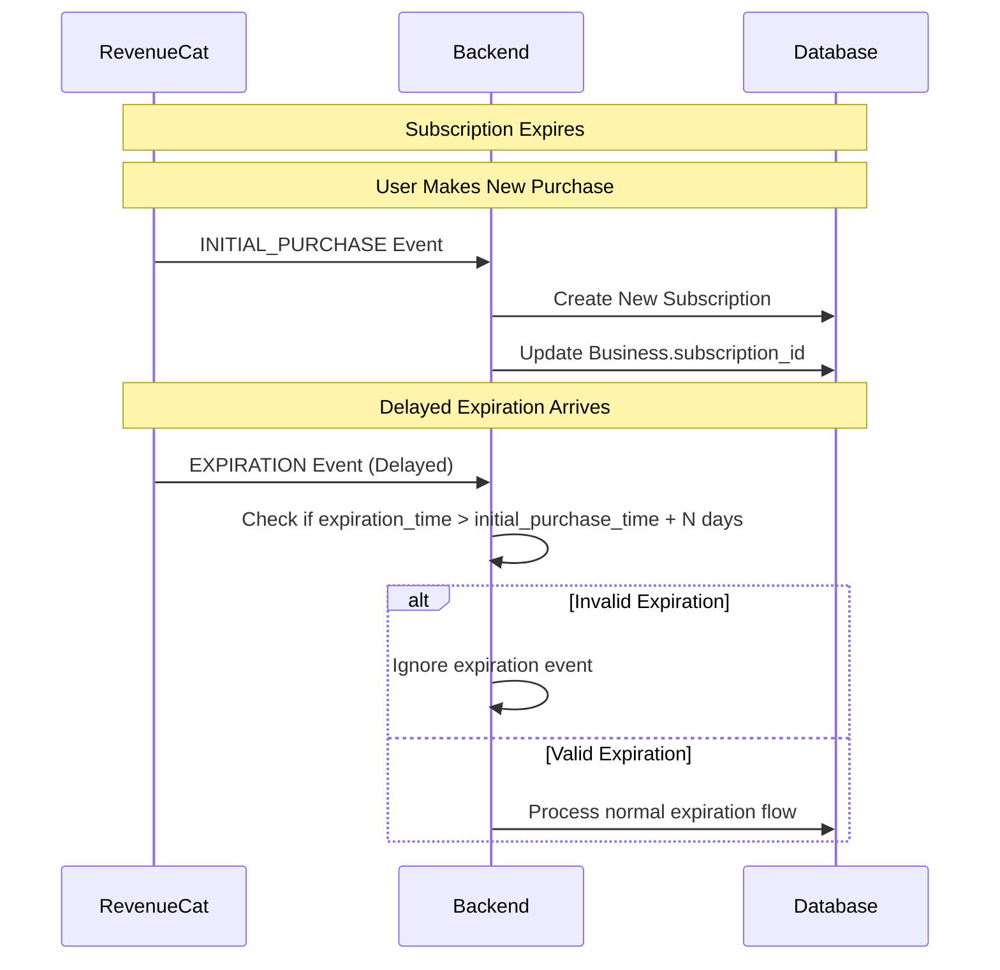
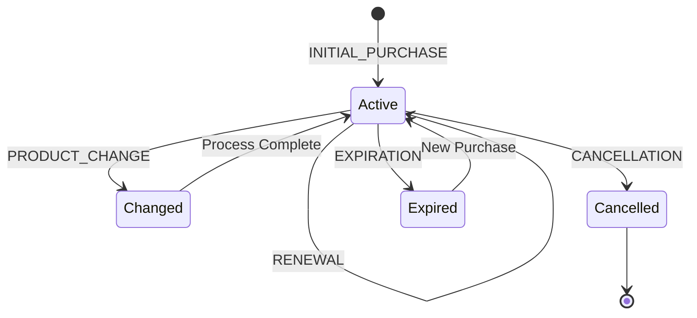

# Subscription Flow Documentation

## Overview

The subscription system operates across iOS and Android platforms using Revenue Cat as the subscription management platform, with a custom backend for business logic and state management.

### Core Components

1. **Client Applications (iOS/Android)**
   - Flutter SDK implementation
   - Revenue Cat SDK integration
   - Platform-specific purchase flows

2. **Revenue Cat**
   - Manages subscription offerings
   - Handles cross-platform purchases
   - Provides webhook notifications
   - Tracks subscription lifecycle

3. **Backend Service**
   - Stores subscription data
   - Processes webhook events
   - Serves as source of truth
   - Manages business relationships

## Integration Architecture

## Subscription Data Flow

### Initial Load and Offering Display

### Purchase Flow

## Webhook Event Processing

### Event Types and Handling

## Detailed Process Flows

### 1. Offering Management

#### Client-Side Flow

### 2. Purchase Processing Flow

## Product ID Structure

### Format
`kelola-{tier}-{period}-{offering_number}-{platform-code}`

### Revenue Cat Configuration
- Mapped to platform-specific store products
- Consistent across platforms
- Managed through Revenue Cat dashboard

## Database Structure

### Tables Relationship

## Webhook Event Processing

### 1. INITIAL_PURCHASE
- Create new record in subscriptions table
- Update business.subscription_id with new subscription
- Set subscription status as active

### 2. RENEWAL
- Create new record in subscriptions table
- Update business.subscription_id with new subscription
- Maintain subscription status as active

### 3. PRODUCT_CHANGE
- Create new record in subscriptions table
- Platform-specific behavior:
  - iOS: Update business.subscription_id
  - Android: Keep existing business.subscription_id

### 4. CANCELLATION
- Create new record in subscriptions table
- Keep existing business.subscription_id
- Update subscription status

### 5. EXPIRATION
- Create new record in subscriptions table
- Remove subscription_id from business table
- Set subscription status as expired

### Edge Case: Delayed Expiration Events

#### Expiration Validation Logic
- Compare expiration event timestamp with latest initial purchase
- If expiration occurs N days after new purchase:
  - Consider expiration event invalid
  - Maintain current subscription status
  - Log incident for monitoring

## Backend API Integration

### Primary Endpoints
1. **Subscription Status**
   - GET /api/business/{businessId}/subscription
   - Returns current subscription state

2. **Business Subscriptions**
   - GET /api/user/businesses/subscriptions
   - Returns all owned business subscriptions

3. **Webhook Handler**
   - POST /api/webhooks/revenuecat
   - Processes Revenue Cat events

## State Management

### Subscription States

## Error Handling

### Common Scenarios
1. **Webhook Processing Errors**
   - Retry mechanism
   - Error logging
   - Alert system

2. **Purchase Failures**
   - Revenue Cat error handling
   - User feedback
   - Status consistency checks

3. **State Synchronization**
   - Backend/Revenue Cat reconciliation
   - Data consistency checks
   - Recovery procedures

## Platform-Specific Considerations

### Android
1. **Play Store Integration**
   - Revenue Cat product mapping
   - Purchase flow handling
   - Up to 5 business subscriptions

### iOS
1. **App Store Integration**
   - Revenue Cat product mapping
   - Purchase flow handling
   - Up to 2 business subscriptions
